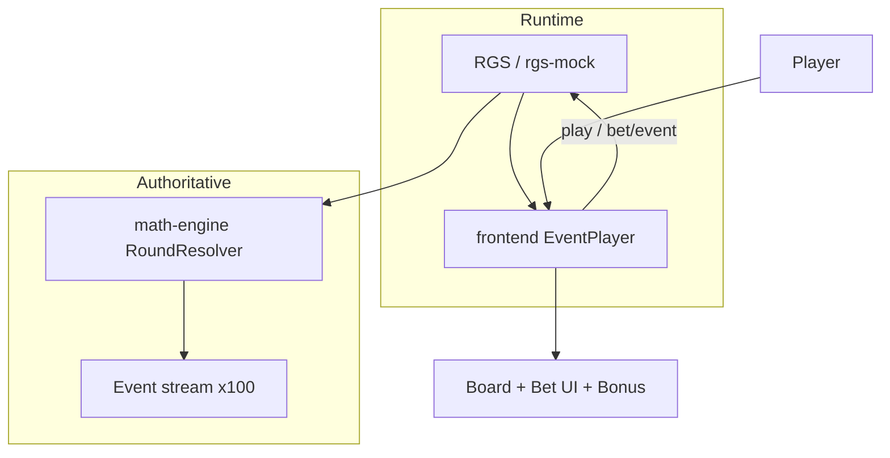

# CRYPTO MINES — Implementation Plan

## Phase 1 — Environment (complete)

| Finding | Detail |
|--------|--------|
| Workspace | Empty git repo; greenfield build |
| Reference | Stake skills cloned locally as `_stake-skills-ref` (gitignored) |
| RGS contract | `authenticate` → `play` → `bet/event` (in-round) → `end-round`; replay via `GET /bet/replay/{game}/{version}/{mode}/{event}` |
| Currency | API `×1_000_000`; book/math multipliers `×100` |
| Frontend stack | Vite, `base: "./"`, deterministic event playback (Svelte + TS) |
| Validator | Stake `validate-rgs-events.mjs` expects terminal `finalWin`/`roundResult`, `setTotalWin`, slot-oriented types; CRYPTO MINES maps gameplay to `reveal`, `multiplierUpdate`, `enterBonus`, `bonusPick`, `finalWin` plus game payload in `fields` |

## Repository layout

```
cryptomines/
  docs/                    # GDD, math, design, QA
  math/                    # config.yml, index.json, fixtures, generated books (CI)
  packages/
    shared/                # Events, currency, constants, state types
    math-engine/           # Authoritative round logic + simulator
    rgs-mock/              # Local RGS for dev/replay tests
  frontend/                # Vite Svelte client — playback only
  scripts/                 # Stake validation scripts (from skills repo)
```

## Architecture



**Rule:** `math-engine` is the only module that assigns mines, symbols, chain, vault bonus, and payouts. Frontend never uses `Math.random()` for outcomes.

## Game modes

| Mode ID | Description |
|---------|-------------|
| `base` | Standard play; mine count 1–24 selected at bet time |

Per-mine-count multiplier tables precomputed; RTP target 96% ±0.20% (sign-off).

## Event mapping (Stake-compatible)

| Game semantic | Stake type | Notes |
|---------------|------------|-------|
| ROUND_START | `reveal` + `revealType: roundStart` | Board sealed; mine count in fields |
| TILE_REVEAL safe | `reveal` + `revealType: tileSafe` | Symbol, index, chain delta |
| TILE_REVEAL mine | `reveal` + `revealType: tileMine` | Terminal loss path |
| MULTIPLIER_UPDATE | `multiplierUpdate` | Book scale |
| CHAIN_UPDATE | `multiplierUpdate` + `source: chain` | Chain tier applied |
| VAULT_TRIGGER | `enterBonus` | Transition to vault bonus |
| BONUS choices | `bonusPick` | Predetermined payout; UI picks vault A/B/C |
| CASH_OUT | `setTotalWin` + `finalWin` | |
| ROUND_END | `finalWin` | Single terminal |

Custom validator: `scripts/validate-crypto-mines-events.mjs` (ordering + required fields).

## Math phases (3–5)

1. Base survival multipliers: `mult_k = floor(RTP_BASE × ∏_{i=0}^{k-1} (25-i)/(25-M-i) × 100)` capped at `MAX_WIN_MULT × 100`.
2. Symbol weights on safe cells (BTC, ETH, SOL, USDT, DIAMOND, VAULT); VAULT frequency budgeted for bonus RTP slice.
3. Chain: ordered triples (BTC→ETH→SOL, ETH→SOL→USDT, SOL→USDT→DIAMOND) grant +5%, +8%, +12% to **current** cashout multiplier when completed (book adds to multiplier field, capped).
4. Vault bonus: on VAULT symbol, `enterBonus`; three chest multipliers `{low, mid, high}` pre-assigned; player pick is cosmetic; EV = `avgBonusMult × currentBaseMult`.
5. Simulator: seeded PRNG (Node `crypto.createHash` stream); strategies: random cashout depth, greedy max picks, vault/chains enabled; report RTP CI.

## Frontend phases (9–17)

- Design tokens in `DESIGN_SYSTEM.md` → CSS variables
- SVG symbol system (no emoji)
- GSAP timelines driven by `EventPlayer` queue
- Replay query params disable betting per Stake checklist

## Testing phases (18)

- Vitest: currency conversion, max win cap, state machine transitions, replay byte-identical streams
- Math: 1M quick gate in CI; 20M sign-off script locally

## Current execution order

1. ✅ Phase 1 inspection  
2. 🔄 Phase 2 `GAME_DESIGN.md` + specs  
3. 🔄 Phase 3–4 math-engine + simulator  
4. ⏳ Phase 6–8 RGS mock + events + replay  
5. ⏳ Phase 9–16 frontend + assets + motion + audio  
6. ⏳ Phase 18–20 validation + report  

## Blockers / external

- Production RGS credentials and book upload pipeline require Stake Engine project linkage (not in empty repo).
- `rgs-mock` satisfies local deterministic development until platform hookup.
